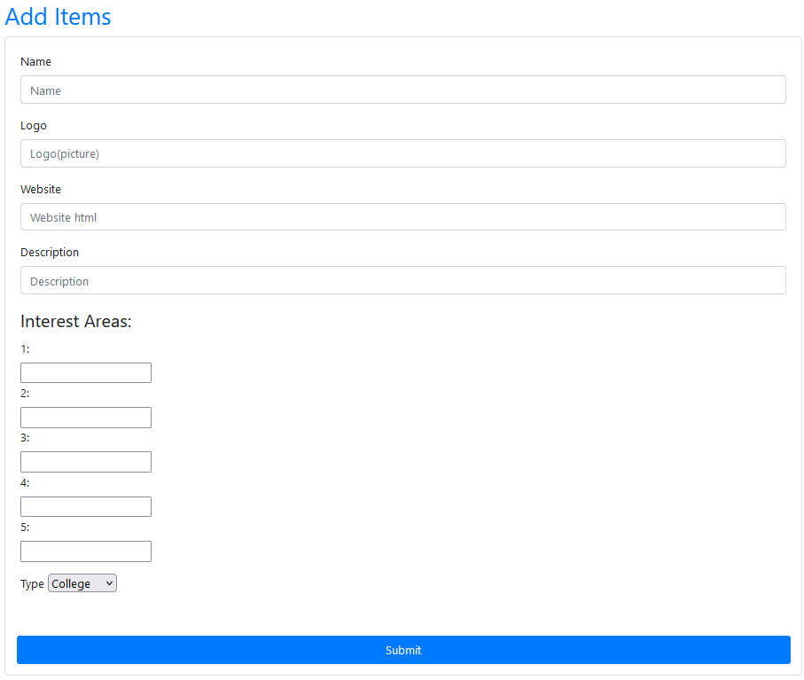

# SICTC College and Career Fair Website

**Table of Contents**
1. [Overview](#overview)  
       &nbsp;&nbsp; a. [What each file does](#what-each-file-does)  
       &nbsp;&nbsp; b. [The Process](#the-process)
3. [Pushing information to Firebase](#pushing-information-to-firebase)
4. [Pulling information from Firebase](#pulling-information-from-firebase)
5. [Displaying information to the website using javascript](#displaying-information-to-the-website-using-javascript)

## Overview

### What each file does

The SICTC College and Career Fair Website, which throughout this documentation will be called CCF, is comprised of four main parts.
  1. index.html - The main html file that is used to display the website.
  2. get.js - The main javascript file which retrieves information from firebase and builds each card (each college/company).
  3. addCard.html - An html file which has a form used to submit information neatly to firebase.
  4. bootstrap.css - An [open-source CSS style sheet](https://getbootstrap.com/) used for styling throughtout the CCF website.

A "card" is each visibly distinguisable section comprised of a college or company on the webpage.

### The Process

In order to add a new college/company:
  1. Open the addCard.html file
  2. Fill out the form and click submit

The newly pushed data will immediately be displayed on the main page. If not, refresh the page.

No action is required to display new information because the website updates when a firebase value is changed or added.

## Pushing information to Firebase

Any new college/company is added through the addCard.html file, a basic html form that has been formatted with bootstrap. This allows information to added easily and effciently without having to add it manually in firebase.

</img>

A static firebase script needs to be ran in order to help with initialzation of firebase into the code.

```js
<script src="https://www.gstatic.com/firebasejs/3.7.4/firebase.js"></script>
```

A firebaseConfig variable is made to store the api information to connect to the firebase.
The CCF website's config variable looks like this:
```js
var firebaseConfig = {
		apiKey: "AIyaSyAnbiYMGExQslJ9styiklG-WPIp6vFBIbE",
		authDomain: "sictc-career-fair.firebaseapp.com",
		projectId: "sictc-career-fair",
		storageBucket: "sictc-career-fair.appspot.com",
		messagingSenderId: "513234127322",
		appId: "1:513434627352:web:bc29fecd5ceeea674b3943",
		measurementId: "G-1GKEYRNJXY",
		databaseURL: "https://sictc-career-fair-default-rtdb.firebaseio.com/"
		};
```
This information is provided when setting up a database for html applications. [See here](https://medium.com/evenbit/getting-started-with-firebase-real-time-database-for-the-web-f53b527aae27)
You may need to add the databaseURL section to the config. This can be done by going to "Realtime Database" then copying the link that appears just above the values in the database.

Then the firebase is initialized, meaning it connects into your code.
```js
firebase.initializeApp(firebaseConfig);
```

A reference is made to the "Items" catagory so that it pushes information to the same area.
```js
var itemsRef = firebase.database().ref('Items');
```

An event listener is also placed on the form (infoForm) so that the information is pushed when, and only when, the user presses submit.
The event lister listens for the "submit" id, and then runs submitForm function.
```js
document.getElementById('infoForm').addEventListener('submit', submitForm);
```

Once the user clicks submit:
  1. The embedded javascript code grabs the information of each form element using their ids and stores each one in a variable.

  2. These variables are then passed into the saveMessage function and the form is reset.
```js
function submitForm(e) {e.preventDefault();
	var name = getInputVal('name');
	var logo = getInputVal('logo');
        var web = getInputVal('web');
        var desc = getInputVal('desc');
	var ia1 = getInputVal('ia1');
	var ia2 = getInputVal('ia2');
	var ia3 = getInputVal('ia3');
	var ia4 = getInputVal('ia4');
	var ia5 = getInputVal('ia5');
	var type = getInputVal('type')

	saveMessage(name,logo,web,desc,ia1,ia2,ia3,ia4,ia5,type);
	document.getElementById('infoForm').reset();
}

// Function to get get form values
function getInputVal(id) {
	return document.getElementById(id).value;
}
   ```

  3. The saveMessage function then makes a firebase reference (a reference id stored in a variable unique to each college/company).
  
  4. This new reference is then set with the form variables we passed in earlier in the form of a dictionary with key:value pairs.

  5. The .set() method automatically pushes this information to firebase with a unique reference that was made earlier.
  ```js
  function saveMessage(name,logo,web,desc,ia1,ia2,ia3,ia4,ia5,type) {
	var newMessageRef = messagesRef.push();
	newMessageRef.set({
	      name: name,
          logo: logo,
          web: web,
          desc: desc,
		ia1: ia1,
		ia2: ia2,
		ia3: ia3,
		ia4: ia4,
		ia5: ia5,
		type: type,
       });
}
  ```

## Pulling information from Firebase

Information in the CCF Website is pulled by using a javascript (get.js) file that writes out each individual card into the index.html file. Basically, for each college/company in the database, it will build out a card with all of its information and add it onto the previous cards.

The first thing to do, similarly to the addCard.html file, is to import a static script in order to help with the initialzation of firebase.
```js
import { initializeApp } from "https://www.gstatic.com/firebasejs/9.0.2/firebase-app.js";
```

Next, the firebaseConfig variable is defined and firebase is initialized. 
```js
var firebaseConfig = {
		apiKey: "AIyaSyAnbiYMGExQslJ9styiklG-WPIp6vFBIbE",
		authDomain: "sictc-career-fair.firebaseapp.com",
		projectId: "sictc-career-fair",
		storageBucket: "sictc-career-fair.appspot.com",
		messagingSenderId: "513234127322",
		appId: "1:513434627352:web:bc29fecd5ceeea674b3943",
		measurementId: "G-1GKEYRNJXY",
		databaseURL: "https://sictc-career-fair-default-rtdb.firebaseio.com/"
		};
		
firebase.initializeApp(firebaseConfig);
var database = firebase.database();
```

The database variable is made so that firebase.database() can be condense and it makes it easier to write later on.

Next, a prototype function is added to the String class in order to make formatting strings easier, similar to how strings are formatted in Python. This will be very useful later.
```js
if (!String.prototype.format) {
    String.prototype.format = function() {
        var args = arguments;
        return this.replace(/{(\d+)}/g, function(match, number) { 
            return typeof args[number] != 'undefined'
                ? args[number]
                : match
            ;
        });
    };
}
```

Now comes the exiting part, actually pulling down the information. This is done in a singular function defined as getRef(). Technically, defining the getRef() function is not necessary for one-time use cases and depends on the application or if filtering is involved. Defining it like this makes it easier to add more functionality.

```js
function getRef(){
```

The function first makes a reference to "Items" which is the catagory the colleges/companies are stored in as defined in addCard.html. This is where we are grabbing each item.

The .on() method activates anytime a parameter is changed. In this case, the .on() method runs anytime a value is changed/added/deleted.

It then takes a snapshot of the entire "Items" catagory and passes it into a lambda function (=>). 

```js
database.ref("Items").on('value', (snapshot) => {
```

In index.html, the body is assigned an id of "body-output". We call the document that the script is ran in, get the body element by its id, and edit the inner html of the body.

The inner html is cleared to prevent duplication when the database is changed or if a new value is added. This is extremely important to have because the website could get overloaded and slow if there is a lot of data in the database.

```js
document.getElementById("body-output").innerHTML = "";
```

Then, the constant variable data is defined as the value (val()) of snapshot. This makes the snapshot variable readable in javascript.

```js
const data = snapshot.val();
```

Currently, the data variable is a single-item dictionary with the key being "Items" and the values of that key being each college/company. Each college/company is a dictionary of its own with dictionaries inside of it as well. This makes the data variable a 3-dimensional dictionary. Beautiful.

In order to get the information to a more usable state, it will have to be disected a little bit.

The variable "items" is defined as the values of data, separting the colleges/companies from the first layer of the dictionary. Imagine Shrek, he's got layers like an onion, and so does this dictionary.

```js
var items = Object.values(data);
```

Now, a for loop is needed to iterate through each college/company, which are their own dictionaries with dictionaries inside. We are now down to a 2-dimensional dictionary. This is like dictionary inception.

This for loop iterates through each item in the "items" variable and passes it into the addCard() function, which is elaborated in the next section.

```js
for (let l in items){
            addCard(items[l]);
        }
```

Fully completed, the function should look as follows:

```js
function getRef(){
    database.ref("Items").on('value', (snapshot) => {
        document.getElementById("body-output").innerHTML = "";
        const data = snapshot.val();
        var items = Object.values(data);
        for (let l in items){
            addCard(items[l]);
        }
    });
}
```

## Displaying information to the website using javascript


